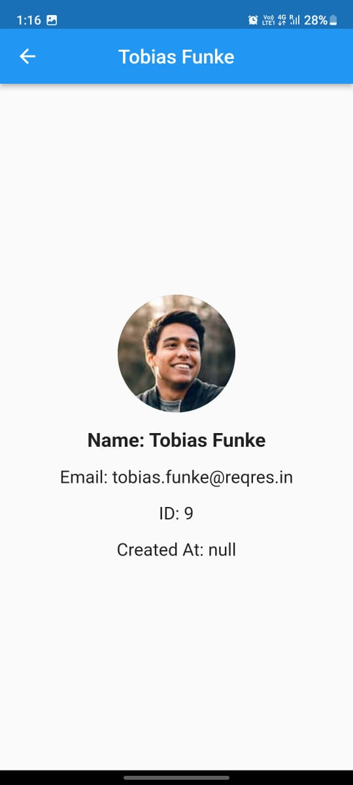
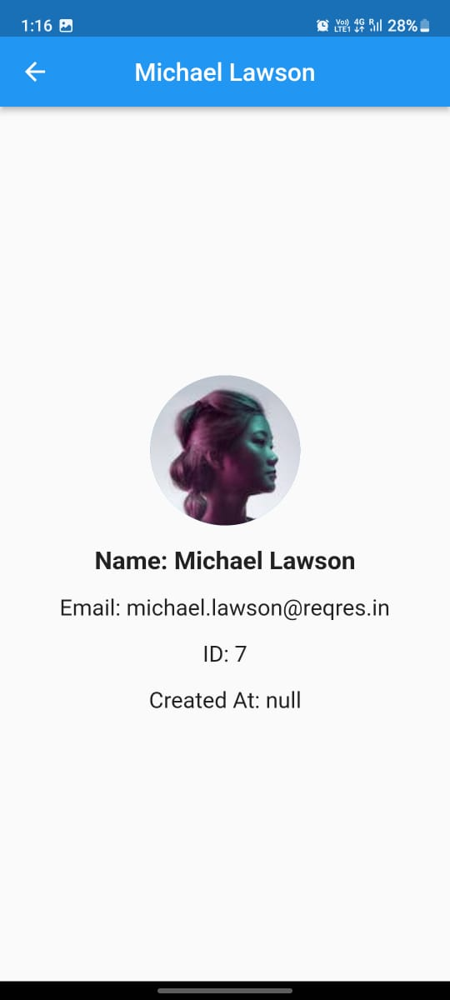
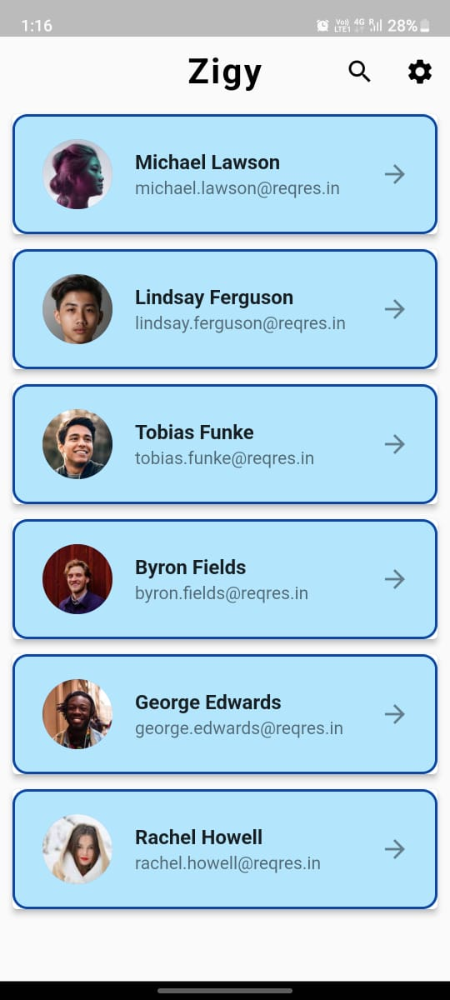

# README

This is a test app built using Flutter for Zigy. The purpose of this app is to demonstrate my skills as a Flutter developer and showcase my ability to create a functional app that meets the requirements of the project.

## Screenshots

Here are some screenshots of the app:

    

## Installation

You can download the APK for the app from the following link:

[Download APK](https://example.com/myapp.apk)

## Requirements

To run this app, you will need to have Flutter installed on your system. You can find instructions on how to install Flutter on the official Flutter website.

## Usage

To use the app, simply install it on your device and launch it. The app is designed to be user-friendly and intuitive, so you should be able to start using it right away.
